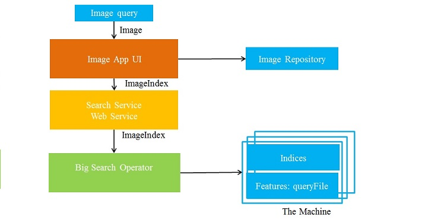

## Overview
Image search is one example of an application that requires high-dimensional similarity search. Imagine if one has to search through all recorded images to determine the presence of a person of interest specified by his picture. To accomplish such a task requires an accurate search on a large corpora of images that returns the images most similar to the query image. An enormous amount of computing power may be required to perform this search quickly and accurately. 
To perform this search, each image is represented by several hundred to thousands of features which are used for scene detection or face identification. Each image is thus represented as a point in high-dimensional space whose coordinates are given by these feature values. Such a representation is common in many analytics applications. The similarity search task takes as input a database of points and a query point q in high-dimensional space, and returns a specified number of points from the database that are closest to q, where closeness is formalized by some distance measure such as Euclidean distance.

## System Design

Image Search App is designed as 3 layers.  The UI layer enables the user to select an image file and search its similar images. The user can visualize the image results sent by Search service loading the images from our internal repository which contains all the possible images available to look for

The search service calls the operator program which executes the search algorithm. The web service interacts with the operator to retrieve the results to the UI. The operator implements several mechanisms to execute the search operations on The Machine.
The operator code is highly optimized running directly in distributed or shared memory environment.

## WebServices
The image search service offers a library of web services exposed on 2 main components:  

1. Image upload: A web service for uploading an image in order to search similar images.

2. Image Search: 
-	Three methods for searching similar images: In-memory, Simulated Machine and Disk-based.

-	The search methods retrieve 2 elements: top 5 similar image identifiers sorted by similarity and the search time.

-	Each search method exposes a separated web service.

