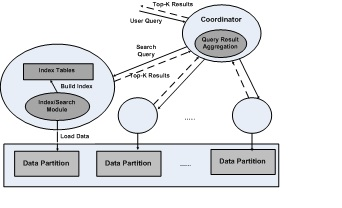

## Overview
We have a working implementation of the LSH-based search framework on high-dimensional data sets.
While the system aims primarily to minimize query latency, it is also designed to maximize query throughput
through concurrent query execution. Simultaneous queries for users are accepted at the coordinator and then get distributed
immediately to each partition

## System Design

Our parallel Similiraty Framework is:

The data set is divided into partitions. Each partition is indexed and searched by a dedicated set of cores assigned to a
NUMA node. The samevalues are applied to all partitions. The partition size is chosen such that
the entire index of the partition, namely, all the hash tables will fit into the local memory of the assigned NUMA node. 
A coordinator process receives the search query and distributes it to all partitions via a broadcast mechanism. 
Similarly at each partition, M worker threads are devoted to handle query processing.
The partitions and the coordinator execute asynchronously. The communication between the coordinator and partitions is
via ZeroMQ’s distributed messaging protocol.

