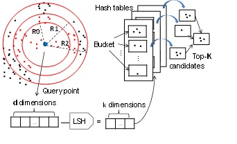

##Overview
We present our work on building a similarity search framework based on LSH. We address the following algorithmic
challenges: a) building an accurate parallel search algorithm based on LSH for large datasets, b) trading-off the memory
consumed, query response time and search accuracy, and c) projecting the response time for larger data sets. We also
address the following systems challenges: a) constructing large space-efficient in-memory index tables at local memory access
speed, b) supporting asynchronous concurrent query execution, and c) optimizing the indexing and search core routines for a
multicore big memory environment.

## Similarity Search 
We build a similarity search index based on LSH hash functions which probabilistically map close points to the same hash value, and far away points to different hash values. As shown in Figure 1, each hash function maps the input point to a k-dimensional vector. This function is applied to all the points in the database to build a hash table where points that get mapped to identical k-dimensional vectors are grouped into the same bucket. This process is repeated L times with independent hash functions to obtain L hash tables, which constitute our similarity search index. Given a query point q, the same hash functions are applied to the query to obtain the hash values corresponding to each of the L tables. The points which are in at least one of the buckets corresponding to these L hash values are retrieved as candidate points and their distances to q are computed to determine the K most similar points, where K is specified by the user. If the number of candidate points retrieved is only a small fraction of the size of the database, the similarity search can be sped up significantly. 

## System Design

Our parallel Similiraty Framework is:

The data set is divided into partitions. Each partition is indexed and searched by a dedicated set of cores assigned to a
NUMA node. The same 𝑘, 𝐿 and (𝑅0 , … , 𝑅𝑚−1) values are applied to all partitions. The partition size is chosen such that
the entire index of the partition, namely, all the hash tables will fit into the local memory of the assigned NUMA node. 
A coordinator process receives the search query and distributes it to all partitions via a broadcast mechanism. 
Similarly at each partition, M worker threads are devoted to handle query processing.

